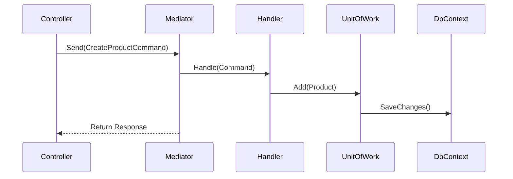
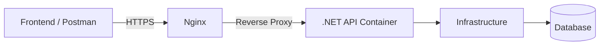

# 🧩 AGENTS.md — .NET Core (C#) Backend System Design

## Overview
This backend project was developed as part of a technical interview assessment to demonstrate senior-level software engineering capability. It applies Clean Architecture, CQRS, security best practices, and production-grade design principles, with comprehensive unit test coverage across the application and domain layers.

The system is structured for maintainability, scalability, and testability. It enforces strict separation of concerns and dependency inversion so that business logic remains isolated from frameworks, databases, and external services, making the solution easy to evolve or swap integrations.

## 🏗️ Architecture Overview
The solution follows Clean Architecture with strict layering:

```
Presentation (WebAPI)
    ↓
Application (CQRS Commands/Queries)
    ↓
Domain (Entities / Value Objects)
    ↓
Infrastructure (EF Core, Repositories, Token Service)
```

Each layer communicates only through defined interfaces, preserving loose coupling and enabling comprehensive mocking in tests.

## 🧠 Core Agents
### 1. Application Layer (Command/Query Handlers)
- **Namespace:** `Khaikhong.Application`
- Implements the CQRS pattern via MediatR, splitting writes (commands) from reads (queries).
- Applies FluentValidation to enforce input integrity before execution.
- Uses AutoMapper to translate between DTOs and domain entities.
- Coordinates work through `IUnitOfWork` to guarantee transactional consistency.
- Fully testable with `IMediator` and mocked abstractions—no framework dependencies required.



### 2. Domain Layer (Core Business Model)
- **Namespace:** `Khaikhong.Domain`
- Holds entities, value objects, and domain events, completely framework-agnostic.
- Uses immutability where it improves invariants and reduces side effects.
- **Key entities:** `User`, `RefreshToken`, `Product`, `ProductVariant`.
- **Base abstractions:** `BaseEntity` (Id, CreatedAt, UpdatedAt, IsActive) and `AuditableEntity` (CreatedBy, UpdatedBy).
- Enum extension helpers such as `UserRole.GetDescription()` keep business logic expressive while mapping cleanly to persistence and API layers.

### 3. Infrastructure Layer (Data Access & External Services)
- **Namespace:** `Khaikhong.Infrastructure`
- Supplies persistence, repository implementations, and external integrations.
- Maintains two DbContexts:
  - `IdentityDbContext` for authentication data.
  - `KhaikhongDbContext` for business entities.
- Employs a Unit of Work to coordinate transactions across contexts when a request spans identity and business data.
- Provides cross-cutting services:
  - `CurrentUserService` surfaces the authenticated user via `IHttpContextAccessor`.
  - `TokenService` issues and renews RSA-based JWT access tokens and hashed refresh tokens.
- Repository abstractions keep EF Core details out of the application layer, improving testability.
- RSA key material (public/private) is injected as base64-encoded PEM strings via `JwtSettings`, removing runtime file-path dependencies and simplifying container deployments.

### 4. WebAPI Layer (Presentation & API Gateway)
- **Namespace:** `Khaikhong.WebAPI`
- Built on ASP.NET Core 10 to expose secure REST endpoints for authentication, user management, and product workflows.
- Configures the host with modular startup extensions such as `AddApplication()` and `AddInfrastructure()`.
- Middleware pipeline enforces `UseAuthentication()` and `UseAuthorization()`.
- Generates OpenAPI/Swagger documentation for discoverability and client generation.



## 🔐 Security Architecture
| Concern | Approach |
| --- | --- |
| Authentication | RSA-based JWT (RS256) issued by `TokenService`. |
| Authorization | Claims-based, mapped to user roles. |
| Refresh Tokens | Stored hashed with expiry, revocation, and device tracking. |
| Data Protection | Secrets injected via `.env`; never hardcoded. |
| HTTPS Enforcement | Enforced at ingress (Cloudflare / Nginx) and within ASP.NET Core policies. |
| Cookie Security | `HttpOnly`, `Secure`, and `SameSite=Strict` where applicable. |

**Key management:** RSA key pairs are stored as base64-encoded PEM strings in environment variables and decoded at startup—no file-system dependency or embedded secrets.

## 🧪 Unit Testing Strategy
| Layer | Tooling | Scope |
| --- | --- | --- |
| Application | xUnit + Moq | Command/query handlers and validators, verifying orchestration and edge cases. |
| Domain | xUnit | Entity invariants, value object behavior, and domain events. |
| Infrastructure | EF Core InMemory Integration Tests | Repository correctness, Unit of Work behavior, and token workflows. |

Tests run within CI to validate all commands, queries, and domain rules, following clear Arrange–Act–Assert formatting with dependency injection via mocks or in-memory providers.

## ⚙️ Configuration Management
- Configuration aligns with 12-factor principles for environment-driven behavior.
- Sources:
  - `appsettings.json` — base configuration.
  - `appsettings.{Environment}.json` — environment overrides.
  - `.env` — sensitive variables (database credentials, base64-encoded RSA keys, JWT settings).
- Bootstrapped with `builder.Configuration.AddJsonFile(...).AddEnvironmentVariables()`.

**Example `.env`:**
```
CONNECTIONSTRINGS__DEFAULTCONNECTION=server=localhost;port=3306;database=khaikhong;user=root;password=1234
JWTSETTINGS__PRIVATEKEYBASE64=PFJFUExBQ0VfV0lUSF9CQVNFMjRfRU5DT0RFRF9QUklWQVRFX0tFWV9QRU0+
JWTSETTINGS__PUBLICKEYBASE64=PFJFUExBQ0VfV0lUSF9CQVNFMjRfRU5DT0RFRF9QVUJMSUNfS0VZX1BFTT4=
```

## 🧭 Design Principles Followed
- Clean Architecture with strict layer boundaries and explicit dependency flow. Each layer communicates via interfaces, keeping coupling low and testability high. Business logic never depends directly on framework or infrastructure code.
- CQRS + Mediator pattern for explicit command/query segregation, yielding predictable request handling that is easy to reason about.
- SOLID principles, emphasizing Dependency Inversion and Single Responsibility. Each class owns a single purpose and depends only on abstractions, not concrete implementations.
- Interface-driven design across layers. `IRepository<T>` abstracts persistence, `IUnitOfWork` coordinates transactional consistency, and cross-cutting concerns (`ICurrentUserService`, `ITokenService`, `ILogger<T>`) are injected via interfaces so tests can mock them freely.
- DRY (Don’t Repeat Yourself) and KISS (Keep It Simple, Stupid). Avoid duplication, needless abstraction, and premature optimization—clarity wins over cleverness.
- Guard Clauses over deeply nested conditionals, keeping the happy path obvious and enabling quick failure when inputs are invalid.
- Testability-first mindset—every business rule and command/query handler is isolated behind mocks or in-memory providers to keep unit tests fast and deterministic.
- Security by design—RS256 JWT signing, hashed refresh tokens, environment-based key management, and hardened cookies (`HttpOnly`, `Secure`, `SameSite`).
- Immutability and explicit state—entities favor `readonly` fields or `init` setters to ensure predictable transitions and the ability to reason about concurrency.
- Production-ready deployment—Dockerized containers, environment-variable configuration, and stateless design that fits modern cloud and CI/CD pipelines.
- Consistency and readability—shared naming conventions, `.editorconfig`, and analyzer rules keep the codebase uniform across teams.
- Fail fast, log smart—guard clauses surface errors early, and logs include contextual metadata (`UserId`, `RequestId`) for traceability.
- Explicit is better than implicit—configuration and policies are declared, never hidden behind magic defaults.
- Readability over cleverness—the code is written for humans first, preferring meaningful names and straightforward structure.
- New files must declare only the using directives they truly depend on—avoid adding redundant imports (e.g., `System`) when implicit usings already cover them.

### Response Contract Standardization
- Every controller action returns `ApiResponse<T>` from `Khaikhong.Application.Common.Models`, ensuring consistent `{ status, message, data }` envelopes across success, validation errors, and unexpected failures.
- MediatR handlers compose domain/application results into `ApiResponse<T>` helpers (`Success` / `Fail`) so HTTP concerns remain outside core logic.
- Validation behavior and global exception middleware rely on this wrapper to deliver deterministic payloads to clients.
